# Mu Compiler Generator

<table border = 0>
    <tr><td align="center">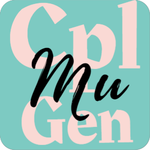</td>       
        <td>
            <p align="center"><strong>MuCompilerGenerator(MuCplGen)</strong></p>
        	<p align="center">a Header-Only dynamic compiler generator based on C++ 17.</p>
        	<p align="center">Why MuCplGen?</p>
        	<ul align="center"><button>header-only</button> <button>cross-platform</button></ul>
        	<ul align="center"><button>self-contained (without any dependencies)</button></ul>
        	<ul align="center"><button>type-safe semantic action (debug-friendly)</button></ul>
    	</td>
    </tr>
</table>
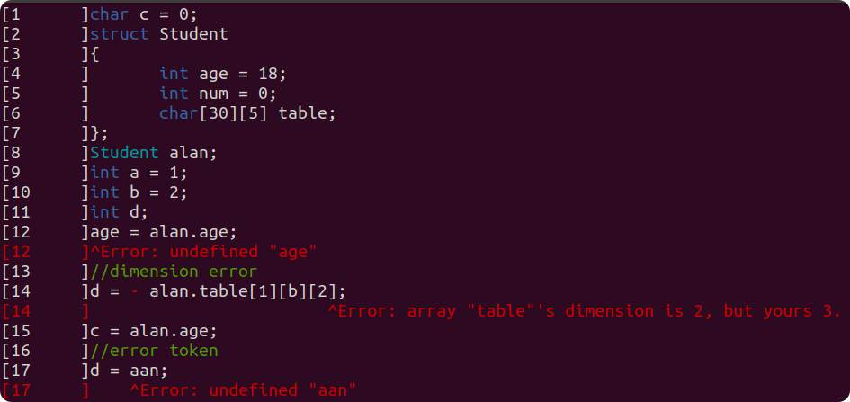

[frequent-update-repo](https://revdolgaming.coding.net/public/musys/MuCompilerGenerator/git/files).

```shell
git clone https://e.coding.net/revdolgaming/musys/MuCompilerGenerator.git
```

Author: lxy819469559@gmail.com

## Introduction

**MuCompilerGenerator(MuCplGen)** is a Header-Only dynamic compiler generator based on C++ 17.

**MuCplGen** covers the front-end of a compiler, which can be divided into 2 parts, respectively **Scanner** and **Parser**. A **Scanner** employs  a **Determined Finite Automaton(DFA)**  to tokenize a series of words. While the rule for word match is called **Regular Expression(Regex)**. And the output of a **Scanner** is a token list, every token in the list contains the info of the word recognized, e.g. the line number, the type, and so on.  Then **Parser** takes the list of tokens as input, working as a **Push Down Automaton(PDA)** to decide whether the token sequence satisfies the designed **Context Free Grammar(CFG)**.

It's annoying to construct **DFA** and **PDA** by yourself(manually), however they are theoretically possible to generate automatically with certain algorithm. **MuCplGen** takes the dull job of this part. 

The only things you need to do is:

- Define the **Token**
- Define the **Regex Rules** for **Scanner**
- Define the **Transform** between **tokens** and **terminators**.
- Define the **CFG** and **Semantic Action** for **Parser**

Yes, your job is to give rules.

## Include MuCplGen

MuCplGen is header-only, copy the folder `MuCplGen` to your include folder, and everything done.

If you want to run the Examples, CMake is required. CMake GUI is recommended.

command line:

```shell
mkdir build
cd build
cmake ..
cmake --build
```

if you are Linux user, make sure that you g++8 is available. [linux install g++8](#install g++8)

## Requirement

|         | c++ std | compiler   |
| ------- | ------- | ---------- |
| Windows | c++17   | MVSC       |
| Linux   | c++17   | g++8       |
| other   | c++17   | :question: |

## Quick Start

In this part we are going to create an easy calculator from scratch, covering using predefined  `EasyScanner`,  implementing a **Parser** and defining its rules.

### Read from Console

Create `main.cpp` in your project. Include `MuCplGen/MuCplGen.h`.

```cpp
//main.cpp
#include <MuCplGen/MuCplGen.h>
using namespace MuCplGen;

int main()
{
	std::vector<LineContent> lines;
	LineContent line;
	line.line_no = 1;
    std::cout << "Calculate:";
	std::cin >> line.content;
	lines.push_back(line);
}
```

For convinience, this time, we read the console as input.

### Recognize Number & Operator

`EasyScanner` is a predefined Scanner, which can recognize:

- number
- arithmetic operator
- relation operator
- ...

we just ask `EasyScanner` to recognize number and arithmetic operator for us.

```cpp
int main()
{
    ...
	EasyScanner easyScanner;
	std::vector<EasyToken> tokens = easyScanner.Scann(lines);
}
```

after scanning, `EasyScanner` returns a list of tokens to us, which will be the input of our Parser.

### Analyze Expression

To define our Parser, we need some rules, which is called **CFG**.

An arithmetic expression can be defined as follows:

```cpp
Expr->	E
//priority 3(+ -)
E	->	E + T
E	->	E - T
E	->	T
//priority 2(* /)
T	->	T * P
T	->	T / P
T	->	P
//priority 1(^)
P	->	P ^ F //power
P	->	F
//priority 0
F	->	Num
F	->	( E )
```

The part on the left of `->` is called **Head** of the production, while items on the right called **Body**. Every production indicates which **Head** can produce which **Body**.

Explaining arithmetic expression in this way help us to take the expression apart tree-like obeying the arithmetic rule.

e.g. When `E -> E + T` happens, we know it's safe and logical to do the addition operation between `E` and `T`, without any fear about the priority.

### Create a Parser

Create a cpp header file in your project, called "Calculator", this time, a `SLR parser` is enough, and we use the predefined token `EasyToken`.

```cpp
using namespace MuCplGen;
class Calculator :public SyntaxDirected<SLRParser<EasyToken>>
{
	Calculator(std::ostream& log = std::cout) : SyntaxDirected(log)
	{

	}
};
```

### Define the Semanitc Action

Once a production happen, the Semantic Action attaching on it will involke.

We use the semantic action to pass on the calculated value, and finally get the result when `Expr -> E` happens. So we need to define how to process and pass on the value in every intermediate production.

Before doing so, we need to tell our parser how we translate an input token as terminator(who can never be a **Head**, cuz as its name, it's the end of the produce process)

```cpp
using namespace MuCplGen;
class Calculator :public SyntaxDirected<SLRParser<EasyToken>>
{
public:
	Calculator(std::ostream& log = std::cout) : SyntaxDirected(log)
	{
		{
			//translate number token as terminator "num"
            //note that, MuCplGen force a terminator to be in Lower Camel Case
			auto& t = CreateTerminator("num");
			t.translation = [this](const Token& token)
			{
				return token.type == Token::TokenType::number;
			};
		}
        ...
	}
};
```

and then, we define the first Semantic Action right after the terminator definition.

```cpp
{
    auto& p = CreateParseRule();
    p.expression = "F -> num";
    //first template parameter is the return type, and others are input parameters
    p.SetAction<float, Empty>(
        [this](Empty)->float
        {
            auto& token = CurrentToken();
            return std::stof(token.name);
        });
}
```

here, when `F -> num` happens, we take the current token, and we know it should be a number, so we just convert it from string to float, and pass it on. Thus any CFG rule who has an `F` in its **Body** can get this float data from the `F`.

Notice that, we places an `Empty` as the parameter, we need it to save a place for those who doesn't pass any data. In this case, the `num` doesn't take any data, so we place `Empty` for it.


as for, `P -> F`, we know `F` takes a `float`, and this production is just for a priority decreasing, without further semantic aim, so we simply `PassOn` the first data. i.e. `P` takes the `float` from `F`.  Thus any CFG rule who has an `P` in its **Body** can get this `float` data from the `P`. 

```cpp
{
    auto& p = CreateParseRule();
    p.expression = "P -> F";
    p.SetAction(PassOn(0));
}
```

`SetAction(PassOn(0))` is defualt.


cool, now we are going to calculate something.

`P	->	P ^ F `

```cpp
{
    auto& p = CreateParseRule();
    p.action_name = "Power()";
    p.expression = "P -> P ^ F";
    p.SetAction<float, float, Empty, float>(
        [this](float P, Empty, float F)->float
        {
            return std::pow(P, F);
        });
}
```

this time, we give a name to this action(only for debug and readability). 

But why is the action so simple? 

We solve the problem from small! We know `P` takes a float data, so does `F`, only thing we need to do is to do the `power(P,F)`.

But, here pay attention to the `Empty` , which saves the place for `^`, cuz `^` doesn't takes any data. if you forget it, the type-safety-checker will throw an exception to you. 


So do the rest rules.

```cpp
{
    auto& p = CreateParseRule();
    p.expression = "T -> P";
}

{
    auto& p = CreateParseRule();
    p.action_name = "Multipy()";
    p.expression = "T -> T * P";
    p.SetAction<float, float, Empty, float>(
        [this](float T, Empty, float P)->float
        {
            return T * P;
        });
}

{
    auto& p = CreateParseRule();
    p.action_name = "Divid()";
    p.expression = "T -> T / P";
    p.SetAction<float, float, Empty, float>(
        [this](float T, Empty, float P)->float
        {
            return T / P;
        });
}

{
    auto& p = CreateParseRule();
    p.expression = "E -> T";
}

{
    auto& p = CreateParseRule();
    p.action_name = "Add()";
    p.expression = "E -> E + T";
    p.SetAction<float, float, Empty, float>(
        [this](float E, Empty, float T)->float
        {
            return E + T;
        });
}

{
    auto& p = CreateParseRule();
    p.action_name = "Sub()";
    p.expression = "E -> E - T";
    p.SetAction<float, float, Empty, float>(
        [this](float E, Empty, float T)->float
        {
            return E - T;
        });
}

{
    auto& p = CreateParseRule();
    p.action_name = "Compress()";
    p.expression = "F -> ( E )";
    p.SetAction(PassOn(1));
}
```


Finially never forget the `Expr -> E`, this is the entrance of all productions, we need to set this rule as the first rule, although it does nothing at all.

```cpp
{
    //translate number token as terminator "num"
    auto& t = CreateTerminator("num");
    t.translation = [this](const Token& token)
    {
        return token.type == Token::TokenType::number;
    };
}

{
    auto& p = CreateParseRule();
    p.expression = "Expr -> E";
    p.SetAction<Empty, float>(
        [this](float res)->Empty
        {
            std::cout << "Result = " << res << std::endl;
            return Empty{};
        });
}
...
```

### Use Our Own Parser

Go back to our main.cpp file, include `Calculator.h`, and create a `Calculator` object in the main function, call `Parse()` on `Calculator` to build the process the input tokens. 

```cpp
//main.cpp
#include <MuCplGen/MuCplGen.h>
#include <Calculator.h>
using namespace MuCplGen;

int main()
{
	std::vector<LineContent> lines;
	LineContent line;
	line.line_no = 1;
	std::cout << "Calculate:";
	std::cin >> line.content;
	lines.push_back(line);

	EasyScanner easyScanner;
	std::vector<EasyToken> tokens = easyScanner.Scann(lines);
    Highlight(lines, tokens);
    
	Calculator calculator;
	calculator.Parse(lines, tokens);
}
```

Run:

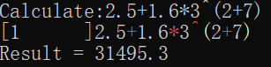

If you have any problem, please check[ `Examples/Calculator`](./Examples/Calculator), or using CMake to build the Examples. 

cool! It works. but, what if something wrong?

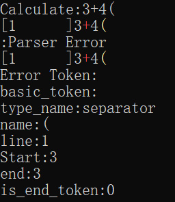

good!

So how can we get more detail debug info, e.g. how the PDA works? 

```cpp
class Calculator :public SyntaxDirected<SLRParser<EasyToken>>
{
public:
	Calculator(std::ostream& log = std::cout) : SyntaxDirected(log)
	{
		debug_option = Debug::DebugOption::ShowReductionProcess;
        ...
    }
}
```

Setup  `debug_option` as `ShowReductionProcess`.

Run again.

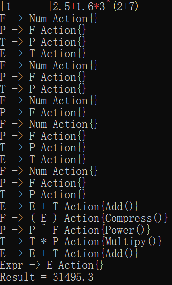

It works pretty well. There are quite a lot of Debug Info MuCplGen can provide, please set the `debug_options` to test the debug info by yourself.

### Further

In the following content, we are going into more details about how MuCplGen works.

- if you want to create a Scanner by yourself please check the Chapter [Scanner](#Scanner).
- if you need more info about Parser, please check the Chapter [Syntax-Directed Parser](#Syntax-Directed Parser)
  - using [SubModule](#SubModule)
  - throw [Semantic Error](#Solve Semantic Error)
  - deal with [CFG Conflict](#CFG Conflict)


## Scanner

Regular Expression (Regex) based.

- Regex Rule for Scanner

    | type            | field                              | detail                             |
    | --------------- | ---------------------------------- | ---------------------------------- |
    | `std::string`   | [`tokenType`](#Regex with Action)  | readability string token type name |
    | `std::regex`    | [`expression`](#Regex with Action) | regex rule                         |
    | `int`           | [`priority`](#Recognize Priority)  | to solve conflicts                 |
    | `std::function` | [`onSucceed`](#Scanner Action)     | callback when token recognized     |

### How Custom Scanner Looks like

```cpp
struct CustomToken : public BaseToken
{
    ...
}

class CustomScanner : public Scanner<CustomToken>
{
    using Token = CustomToken;
    CustomScanner()
    {
        auto& rule = CreateRule();
        rule.tokenType = "typename";
        //regular expression
        rule.expression = R"(....)";
        rule.priority = 0;
        //action
        rule.onSucceed = 
           	[this](std::smatch&, Token& token)->ScannActionResult
        	{
            	return SaveToken;
        	};
        //other rules
        ...
    }
}
```

### Regex with Action

```cpp
auto& num = CreateRule();
//for readability
num.tokenType = "number";
//regex
num.expression = R"(^(\-|\+)?\d+(\.\d+)?)";
//action to do when a token is recoginized
num.onSucceed = [this](std::smatch&, Token& token)->ScannActionResult
{
    //custom data, for fast token type dicision
    token.type = Token::TokenType::number;
    //only for debug token highlight as you can see above
    token.color = ConsoleForegroundColor::White;
    //tell the scanner to save this Token
    return SaveToken;
};
```

:heavy_exclamation_mark:	**Remember** to start your regex with `^`, or something weird may happen. e.g. `Hhello` will match the regex `hello`.

`std::smatch&` is the regex match info, in this case,  ignored.

- view: [EasyScanner.h](MuCplGen/EasyScanner.h)

### Scanner Action

```cpp
auto& blank = CreateRule();
blank.tokenType = "Blank";
blank.expression = CommonRegex::Blank;
blank.onSucceed = [this](std::smatch&, Token&)->ScannActionResult
{
    //to ignore blank as ' ', '\t', '\n' ...
    //if you need the blank token, never Discard it. (e.g. python keeps the blank token)
    return DiscardThisToken;
};

auto& comment = CreateRule();
comment.tokenType = "Comment";
comment.expression = "^//.*";
comment.onSucceed = [this](std::smatch&, Token&)->ScannActionResult
{
    //Skip current line
    //usually, comment should be removed by preprocessor
    //it's just example
    return (ScannActionResult)(DiscardThisToken | SkipCurrentLine);
};
```

view: [EasyScanner.h](MuCplGen/EasyScanner.h)

### Default Action

Default action is to "Save the Token" and of course you can set the default action of a scanner

```cpp
struct Scanner
{
public:
    using ScannAction = std::function<ScannActionResult(std::smatch&, Token&)>;
    ScannAction defaultAction;
    ...
}
```

- view: [Scanner.h](MuCplGen/Scanner.h)

### Priority

Sometimes conflicts occur, e.g. custom-defined identifier may be the same as your predefined keyword, so there's a priority option for you.

A smaller number indicates a higher priority. Default priority is 0.

```cpp
auto& keyword = CreateRule();
keyword.tokenType = "keyword";
keyword.expression = 
    "^(void|char|float|int|return|enum|struct|class|private|switch"
    "|case|break|default|if|else|while|do)";
keyword.onSucceed = [this](std::smatch, Token& token)->ScannActionResult
{
    token.type = Token::TokenType::keyword;
    token.color = ConsoleForegroundColor::Blue;
    return SaveToken;
};

auto& id = CreateRule();
id.priority = 1;
id.tokenType = "identifier";
id.expression = CommonRegex::Identifier;
id.onSucceed = [this](std::smatch, Token& token)->ScannActionResult
{
    token.type = Token::TokenType::identifier;
    token.color = ConsoleForegroundColor::White;
    return SaveToken;
};
```

So "int" will be a keyword rather than an identifier.

view: [EasyScanner.h](MuCplGen/EasyScanner.h)

### Macroscopic Greedy-Match

A Scanner tent to match as long as it can, i.e. if more than 2 regex rule are satisfied, the longer one will be chosen (if they are same in priority).

e.g. 

- `::` will be recognized as `::` rather than `:`and`:`

- `->`will be recognized as `->` rather than `-`and`>`

which is pretty sensible.

if you want to break the rule, use the priority field of a regex rule.

### Debug Your Scanner

cuz, it's your response to define a Token, so, if you want to highlight the Token in console, derive your token from `DebugToken`

```cpp
namespace MuCplGen::Debug
{
	struct DebugToken :public BaseToken
	{
		ConsoleForegroundColor color = ConsoleForegroundColor::White;
	};
}
```

```cpp
struct MyToken : public DebugToken
{
    ...
}
```

Thus, `MuCplGen::Debug::Highlight()` will highlight your content.

```cpp
auto input_text = FileLoader::Load("easy.txt");
EasyScanner easyScanner;
auto token_set = easyScanner.Scann(input_text);
Debug::Highlight(input_text, token_set);
```

Of curse, `Highlight()` can show error info more readably.

```cpp
template<typename Token = DebugToken>
void Highlight(
    std::vector<LineContent>& input_text, std::vector<Token>& token_set,
    std::vector<std::pair<size_t, std::string>>& error_info_pair, std::ostream& log = std::cout)
```

The first field of `std::pair<size_t, std::string>` is a token iterator,  indicates the error token index in token_set, and the second is, self-explanatory, the error info.

## Syntax-Directed Parser

Context Free Grammar (CFG) based.

| Parser     | Usage                    |                    |
| ---------- | ------------------------ | ------------------ |
| SLR        | `SLRParser<UserToken,T>` | :heavy_check_mark: |
| LR1        | `LR1Parser<UserToken,T>` | :heavy_check_mark: |
| BaseParser |                          | :x:                |

### CFG Conflict

Here we take in an easy example to introduce the CFG Conflict.

```cpp
S_ -> S
S -> F G
S -> G
G -> ( num )
F -> epsilon
```

Here, `epsilon` means  $\epsilon$ (the notation for empty terminator), e.g. $1001 \epsilon 1002 \rarr 10011002 $ 

It's obvious that, there is a conflict between `S->G` and `S->F G`, **PDA** has no idea which to obey, cuz `S->G` and `S->F G` is intrinsically same, they are both `( num )`.

We code as follows.

```cpp
#include <MuCplGen/MuCplGen.h>
using namespace MuCplGen;

class Reader : public SyntaxDirected<SLRParser<EasyToken>>
{
public:
	Reader(std::ostream& log = std::cout)
		: SyntaxDirected(log)
	{
		debug_option = DebugOption::ConciseInfo | DebugOption::ShowProductionTable | DebugOption::ShowReductionProcess;

		{
			//translate number token as terminator "num"
			auto& t = CreateTerminator("num");
			t.translation = [this](const Token& token)
			{
				return token.type == Token::TokenType::number;
			};
		}

		//Entrance:
		{
			auto& p = CreateParseEntrance();
			p.expression = "S_ -> S";
		}

		{
			auto& p = CreateParseRule();
			p.expression = "S -> F G";
		}

		{
			auto& p = CreateParseRule();
			p.expression = "S -> G";
		}

		{
			auto& p = CreateParseRule();
			p.expression = "G -> ( num )";
		}

		{
			auto& p = CreateParseRule();
			p.expression = "F -> epsilon";
		}
	}
};

int main()
{
	Reader reader;
	reader.Build();
}
```

Run:

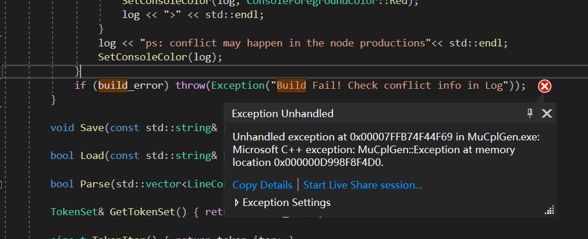

check your log.

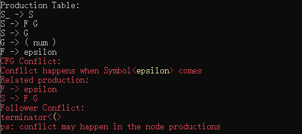

it says, when $\epsilon$ comes, conflict may happen in `S->F G`, and the error production is `F-> epsilon`，the main problem is, the **PDA** has no idea which rule to obey when it read a `(` terminator as input.

- view: [Examples/PDAConflict](./Examples/PDAConflict)

### SubModule

in this chapter we introduce **SubModule**. 

We implement a cool calculator in [Quick Start](#Quick Start), but we find the function of calculating some const expression is pretty common and useful, so we tend to pack it as a sub-module.

Derive your SubModule from BaseSubModule.

```cpp
#include <MuCplGen/MuCplGen.h>

using namespace MuCplGen;
class CalculatorSubModule : public BaseSubModule
{
public:
	CalculatorSubModule(BaseSyntaxDirected* bsd, const std::string& scope) 
		: BaseSubModule(bsd, scope) {}
};
```

`bsd` is the base class of `SyntanxDirected<Parser>`, `scope` is the scope for this SubModule, which will be asigned by the caller, i.e the ourside Parser.

In class `CalculatorSubModule` we define an enum, to provide some choices about which kind of expression can be recognized. And then we implement the abstract virtual function `CreateRules`in base class.

```cpp
enum Config
{
    None = 0,
    Add = 1,
    Sub = 1 << 1,
    Mul = 1 << 2,
    Div = 1 << 3,
    Pow = 1 << 4,
    NoPow = Add|Sub|Mul|Div,
    All = NoPow|Pow 
} config = Config::All;

//Input: [Scope.]Num<float>
//Output: [Scope.]out_nonterm<float>
MU_NOINLINE void CreateRules(const std::string& out_nonterm) override
{
    {
        //output Non-Terminator
        auto& p = CreateParseRule();
        p.head = out_nonterm;
        p.body = { "E" };
    }

    {
        auto& p = CreateParseRule();
        p.expression = "F -> Num";
        p.head = "F";
        p.body = { "Num" };
    }

    {
        auto& p = CreateParseRule();
        p.expression = "P -> F";
        p.SetAction(PassOn(0));
    }

    if(config & Config::Pow)
    {
        auto& p = CreateParseRule();
        p.action_name = "Power()";
        p.expression = "P -> P ^ F";
        p.SetAction<float, float, Empty, float>(
            [this](float P, Empty, float F)->float
            {
                return std::pow(P, F);
            });
    }

    {
        auto& p = CreateParseRule();
        p.expression = "T -> P";
    }

    if (config & Config::Mul)
    {
        auto& p = CreateParseRule();
        p.action_name = "Multipy()";
        p.expression = "T -> T * P";
        p.SetAction<float, float, Empty, float>(
            [this](float T, Empty, float P)->float
            {
                return T * P;
            });
    }

    if (config & Config::Div)
    {
        auto& p = CreateParseRule();
        p.action_name = "Divid()";
        p.expression = "T -> T / P";
        p.SetAction<float, float, Empty, float>(
            [this](float T, Empty, float P)->float
            {
                return T / P;
            });
    }

    {
        auto& p = CreateParseRule();
        p.expression = "E -> T";
    }

    if (config & Config::Add)
    {
        auto& p = CreateParseRule();
        p.action_name = "Add()";
        p.expression = "E -> E + T";
        p.SetAction<float, float, Empty, float>(
            [this](float E, Empty, float T)->float
            {
                return E + T;
            });
    }

    if (config & Config::Sub)
    {
        auto& p = CreateParseRule();
        p.action_name = "Sub()";
        p.expression = "E -> E - T";
        p.SetAction<float, float, Empty, float>(
            [this](float E, Empty, float T)->float
            {
                return E - T;
            });
    }

    {
        auto& p = CreateParseRule();
        p.action_name = "Compress()";
        p.expression = "F -> ( E )";
        p.SetAction(PassOn(1));
    }
}
```

Everything looks like the it was, in [Quick Start](#Quick Start), but the first rules.

This time, we quit the string-based rule, and use the structured head/body.

`head` is the name of out non-term, for the outside parser to retrieve, and `body` is the a vector of string, tells the deduced non-term. The string-based one and the structured one, are equivalent, but the later is more convenient to involve arguments. 


To use SubModule:

In our Main Parser.

```cpp
class MainCalculator : public SyntaxDirected<SLRParser<EasyToken>>
{
    //our SubModule
	CalculatorSubModule cs;
public:
	MainCalculator(std::ostream& log = std::cout) 
		: SyntaxDirected(log), 
		cs(
            this, //BaseSyntaxDirected
           "CalSub" //the scope name for CalculatorSubModule
          )
	{
		debug_option = DebugOption::ConciseInfo | DebugOption::ShowProductionTable;
		generation_option = BuildOption::Runtime;
		
		{
			//translate number token as terminator "num"
			auto& t = CreateTerminator("num");
			t.translation = [this](const Token& token)
			{
				return token.type == Token::TokenType::number;
			};
		}

		{
			auto& p = CreateParseRule();
            //get the ouput data from our SubModule
            //the output data is in the non-term: <scope>.Expr
            //this time <scope> = CalSub
			p.expression = "Expr -> CalSub.Expr";
			p.SetAction<Empty, float>(
				[this](float res)->Empty
				{
					std::cout << "Result = " << res << std::endl;
					return Empty{};
				});
		}
		
		cs.CreateRules("Expr");

		{
			auto& p = CreateParseRule();
            //pass the input data for our SubModule
            //to fill the requirement of CalculatorSubModule
            //we need to pass a float data to <scope>.Num(a non-term in CalculatorSubModule)
            //this time <scope> = CalSub
			p.expression = "CalSub.Num -> num";
			p.SetAction<float, Empty>(
				[this](Empty)->float
				{
					auto& token = CurrentToken();
					return std::stof(token.name);
				});
		}
	}
};
```

In main.cpp:

```cpp
#include <MuCplGen/MuCplGen.h>
#include "Calculator.h"
using namespace MuCplGen;

int main()
{
	MainCalculator calculator;
	calculator.Build();

	std::vector<LineContent> lines;
	LineContent line;
	line.line_no = 1;
	std::cout << "Calculate:";
	std::cin >> line.content;
	lines.push_back(line);

	EasyScanner easyScanner;
	std::vector<EasyToken> tokens = easyScanner.Scann(lines);
	Highlight(lines, tokens);

	
	calculator.Parse(lines, tokens);
}
```

Run:

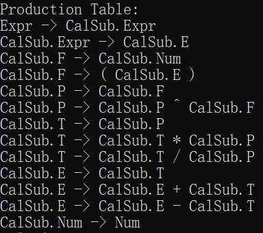


As we can see, in the production table, those who have a scope `CalSub` are the members of the SubModule production table. A scope is necessary for avoiding conflicts. Of curse, it's the duty of main parser to dispatch the scope name, cuz SubModule knows nothing about scope.

Only things the SubModule exposes is the input/output non-term, this time, `CalSub.Num` and `CalSub.E`.

If you have any problem, please check [Examples/CalculatorSubModule](./Examples/CalculatorSubModule)

### Solve Semantic Error

This time, we are going to talk about how to passon semantic error information.

We implement a cool calculator in [Quick Start](#Quick Start), recall:

```cpp
{
    auto& p = CreateParseRule();
    p.action_name = "Divid()";
    p.expression = "T -> T / P";
    p.SetAction<float, float, Empty, float>(
        [this](float T, Empty, float P)->float
        {
            return T / P;
        });
}
```

this is the part we do division. of curse we know, `P` shouldn't be 0. so we want to catch the error, whenever a `0` is passed in. So we try to throw it out. 

```cpp
{
    auto& p = CreateParseRule();
    p.action_name = "Divid()";
    p.expression = "T -> T / P";
    p.SetAction<float, float, Empty, float>(
        [this](float T, Empty, float P)->float
        {
            if (P == 0.0)
            {
                SemanticError se;
                se.error_data.code = ParserErrorCode::SemanticError;
                se.error_data.data = std::string("Error: Div 0");
                throw(se);
            }
            return T / P;
        });
}
```

`SemanticError::error_data.code` is the code to tell parser what to do next, we leave the default value `ParserErrorCode::SemanticError` for let the parser go on.

`SemanticError::error_data.data` is any data, you want to pass. Ok, now the problem is to catch the error data.

```cpp
{
    auto& p = CreateParseRule();
    p.expression = "Expr -> E";
    p.SetAction<Empty, float>(
        [this](float res)->Empty
        {
            std::cout << "Result = " << res << std::endl;
            return Empty{};
        });

    p.SetSemanticErrorAction<Empty>(
        [this](const std::vector<std::any*> data)->Empty
        {
            int next = -1;
            auto error = NextSemanticError(data, next);
            auto error_content = GetErrorData<std::string>(error);
            std::cout << error_context << std::endl;
            return Empty{};
        });
}
```

Recall that, `Expr -> E` is the exit point. If we've never catch the error in intermediate productions, the first error will always passon along the production chain.

In `SetSemanticErrorAction`  we try to get the error information, as we defined, a string info.

Your error_data can be much more complicated, (e.g. pass the token on, to tell the upper production where the error happens, etc.) it's your creation. 

Run:

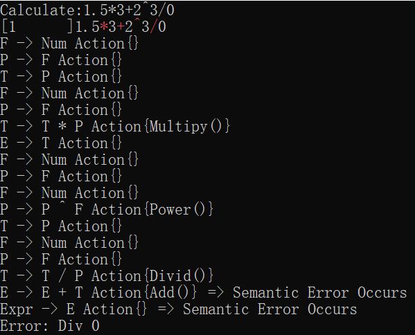

if you have any problem, have a look at [Examples/SolveSemanticError](./Examples/SolveSemanticError).

### Store Tables

It consumes substantial time to build a **PDA** from **CFG**, when the amount of states grows more than 3k. So **MuCplGen** provides a mechanism to store the build result in binary form. 

:heavy_exclamation_mark: The binary form storage is not cross-platform, however, is machine-relative.

It's up to you whether to save or load a build result. (Sometimes IO is slower than directly build a **PDA** ) .

this is the first time to build a **PDA**，which takes 69ms.

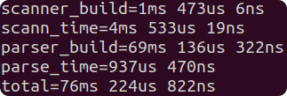

while, the second time, we just load the build result form the disk, which takes only 2ms. We actually solve the most time consuming part. The total time falls as fast as 1/10.

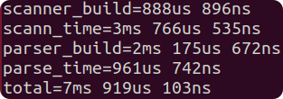

To control the save & load strategy.

```cpp
enum class BuildOption
{
    Runtime = 0,
    Save = 1,
    Load = 1 << 1,
    LoadAndSave = Load | Save
};

//custom code:
struct CustomToken
{
    ...
}

class CustomParser :public SyntaxDirected<SLRParser<CustomToken>>
{
public:
	CustomParser(std::ostream& log = std::cout) :SyntaxDirected(log)
	{
		generation_option = BuildOption::LoadAndSave;
		SetStorage("./storage/ILGen.bin");
        ...
    }
}
```

| enum        | description                                        |
| ----------- | -------------------------------------------------- |
| Runtime     | never load and save, always build a **PDA**        |
| Save        | always save the build result after build a **PDA** |
| Load        | always load the build result from the disk         |
| LoadAndSave | asways load and save.                              |

if load fails, the **Parser** roll back to the runtime mode, rebuild the **PDA** from your **CFG**.

# More Example

### Variable Detector

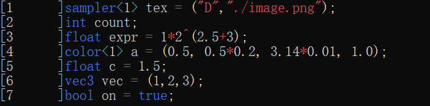

CFG:

```cpp
Prgm -> Stmt.Vec
Stmt.Vec -> Stmt.Comps
Stmt.Sep -> epsilon
Stmt.Comps -> Stmt.Comps Stmt.Sep Stmt.Comp
Stmt.Comps -> Stmt.Comp
Stmt.Comp -> Stnc
Stnc -> VecDef ;
Stnc -> BaseDef ;
Stnc -> VecDef = Vec ;
Stnc -> BaseDef = Base ;
VecDef -> VecType Name
VecDef -> VecType < Loc > Name
BaseDef -> BaseType Name
BaseDef -> BaseType < Loc > Name
Name -> Id
Loc -> Cal.Expr
Vec -> NumVec
Vec -> StrVec
Base -> Str
Base -> Cal.Expr
Base -> true
Base -> false
NumVec -> ( NumVec.Vec )
StrVec -> ( StrVec.Vec )
StrVec.Vec -> StrVec.Comps
StrVec.Sep -> ,
StrVec.Comps -> StrVec.Comps StrVec.Sep StrVec.Comp
StrVec.Comps -> StrVec.Comp
StrVec.Comp -> Str
NumVec.Vec -> NumVec.Comps
NumVec.Sep -> ,
NumVec.Comps -> NumVec.Comps NumVec.Sep NumVec.Comp
NumVec.Comps -> NumVec.Comp
NumVec.Comp -> Cal.Expr
Cal.Expr -> Cal.E
Cal.F -> Cal.Num
Cal.F -> ( Cal.E )
Cal.P -> Cal.F
Cal.P -> Cal.P ^ Cal.F
Cal.T -> Cal.P
Cal.T -> Cal.T * Cal.P
Cal.T -> Cal.T / Cal.P
Cal.E -> Cal.T
Cal.E -> Cal.E + Cal.T
Cal.E -> Cal.E - Cal.T
Cal.Num -> Num
```

- view: [Examples/AutoShaderVariableDetector](./Examples/AutoShaderVariableDetector)

# Appendix

## Install g++8

### ubuntu

bash

```shell
sudo add-apt-repository ppa:ubuntu-toolchain-r/test
sudo apt-get update
sudo apt-get install g++-8
#set g++8 as defualt
sudo update-alternatives --install /usr/bin/g++ g++ /usr/bin/g++-8 100
sudo update-alternatives --config g++
#check the version
g++ --version
```

