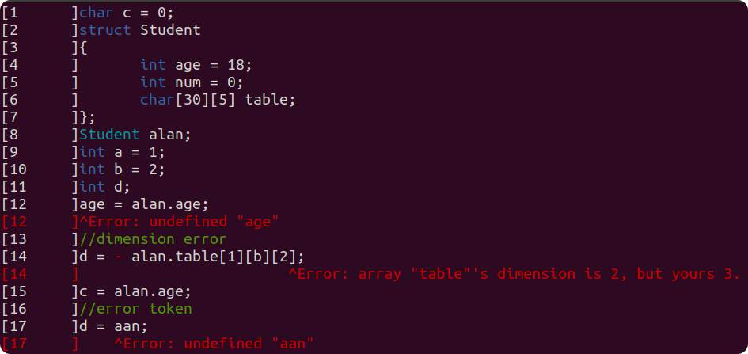

# Mu Compiler Generator

<table border = 0>
    <tr><td align="center"></td>       
        <td>
            <p align="center"><strong>MuCompilerGenerator(MuCplGen)</strong></p>
        	<p align="center">a Header-Only dynamic compiler generator based on C++ 17.</p>
        	<p align="center">Why MuCplGen?</p>
        	<ul align="center"><button>header-only</button> <button>cross-platform</button></ul>
        	<ul align="center"><button>self-contained (without any dependencies)</button></ul>
        	<ul align="center"><button>type-safe semantic action (debug-friendly)</button></ul>
    	</td>
    </tr>
</table>


## Introduction

**MuCompilerGenerator(MuCplGen)** is a Header-Only dynamic compiler generator based on C++ 17.

**MuCplGen** covers the front-end of a compiler, which can be divided into 2 parts, respectively **Scanner** and **Parser**. A **Scanner** employs  a **Determined Finite Automaton(DFA)**  to tokenize a series of words. While the rule for word match is called **Regular Expression(Regex)**. And the output of a **Scanner** is a token list, every token in the list contains the info of the word recognized, e.g. the line number, the type, and so on.  Then **Parser** takes the list of tokens as input, working as a **Push Down Automaton(PDA)** to decide whether the token sequence satisfies the designed **Context Free Grammar(CFG)**.

It's annoying to construct **DFA** and **PDA** by yourself(manually), however they are theoretically possible to generate automatically with certain algorithm. **MuCplGen** takes the dull job of this part. 

The only things you need to do is:

- Define the **Token**
- Define the **Regex Rules** for **Scanner**
- Define the **Transform** between **tokens** and **terminators**.
- Define the **CFG** and **Semantic Action** for **Parser**

Yes, your job is to give rules.

## Include MuCplGen

MuCplGen is header-only, copy the folder `MuCplGen` to your include folder, and everything done.

If you want to run the Examples, CMake is required. CMake GUI is recommended.

command line:

```shell
mkdir build
cd build
cmake ..
cmake --build
```

if you are Linux user, make sure that you g++8 is available. [linux install g++8](#install g++8)

## Requirement

|         | c++ std | compiler   |
| ------- | ------- | ---------- |
| Windows | c++17   | MVSC       |
| Linux   | c++17   | g++8       |
| other   | c++17   | :question: |

## Quick Start

In this part we are going to create an easy calculator from scratch, covering using predefined  `EasyScanner`,  implementing a **Parser** and defining its rules.

[TODO]

## Scanner

Regular Expression (Regex) based.

- Regex Rule for Scanner

    | type            | field                              | detail                             |
    | --------------- | ---------------------------------- | ---------------------------------- |
    | `std::string`   | [`tokenType`](#Regex with Action)  | readability string token type name |
    | `std::regex`    | [`expression`](#Regex with Action) | regex rule                         |
    | `int`           | [`priority`](#Recognize Priority)  | to solve conflicts                 |
    | `std::function` | [`onSucceed`](#Scanner Action)     | callback when token recognized     |

### How Custom Scanner Looks like

```cpp
struct CustomToken : public BaseToken
{
    ...
}

class CustomScanner : public Scanner<CustomToken>
{
    using Token = CustomToken;
    CustomScanner()
    {
        auto& rule = CreateRule();
        rule.tokenType = "typename";
        //regular expression
        rule.expression = R"(....)";
        rule.priority = 0;
        //action
        rule.onSucceed = 
           	[this](std::smatch&, Token& token)->ScannActionResult
        	{
            	return SaveToken;
        	};
        //other rules
        ...
    }
}
```

### Regex with Action

```cpp
auto& num = CreateRule();
//for readability
num.tokenType = "number";
//regex
num.expression = R"(^(\-|\+)?\d+(\.\d+)?)";
//action to do when a token is recoginized
num.onSucceed = [this](std::smatch&, Token& token)->ScannActionResult
{
    //custom data, for fast token type dicision
    token.type = Token::TokenType::number;
    //only for debug token highlight as you can see above
    token.color = ConsoleForegroundColor::White;
    //tell the scanner to save this Token
    return SaveToken;
};
```

:heavy_exclamation_mark:	**Remember** to start your regex with `^`, or something weird may happen. e.g. `Hhello` will match the regex `hello`.

`std::smatch&` is the regex match info, in this case,  ignored.

- view: [EasyScanner.h](MuCplGen/EasyScanner.h)

### Scanner Action

```cpp
auto& blank = CreateRule();
blank.tokenType = "Blank";
blank.expression = CommonRegex::Blank;
blank.onSucceed = [this](std::smatch&, Token&)->ScannActionResult
{
    //to ignore blank as ' ', '\t', '\n' ...
    //if you need the blank token, never Discard it. (e.g. python keeps the blank token)
    return DiscardThisToken;
};

auto& comment = CreateRule();
comment.tokenType = "Comment";
comment.expression = "^//.*";
comment.onSucceed = [this](std::smatch&, Token&)->ScannActionResult
{
    //Skip current line
    //usually, comment should be removed by preprocessor
    //it's just example
    return (ScannActionResult)(DiscardThisToken | SkipCurrentLine);
};
```

view: [EasyScanner.h](MuCplGen/EasyScanner.h)

### Default Action

Default action is to "Save the Token" and of course you can set the default action of a scanner

```cpp
struct Scanner
{
public:
    using ScannAction = std::function<ScannActionResult(std::smatch&, Token&)>;
    ScannAction defaultAction;
    ...
}
```

- view: [Scanner.h](MuCplGen/Scanner.h)

### Priority

Sometimes conflicts occur, e.g. custom-defined identifier may be the same as your predefined keyword, so there's a priority option for you.

A smaller number indicates a higher priority. Default priority is 0.

```cpp
auto& keyword = CreateRule();
keyword.tokenType = "keyword";
keyword.expression = 
    "^(void|char|float|int|return|enum|struct|class|private|switch"
    "|case|break|default|if|else|while|do)";
keyword.onSucceed = [this](std::smatch, Token& token)->ScannActionResult
{
    token.type = Token::TokenType::keyword;
    token.color = ConsoleForegroundColor::Blue;
    return SaveToken;
};

auto& id = CreateRule();
id.priority = 1;
id.tokenType = "identifier";
id.expression = CommonRegex::Identifier;
id.onSucceed = [this](std::smatch, Token& token)->ScannActionResult
{
    token.type = Token::TokenType::identifier;
    token.color = ConsoleForegroundColor::White;
    return SaveToken;
};
```

So "int" will be a keyword rather than an identifier.

view: [EasyScanner.h](MuCplGen/EasyScanner.h)

### Macroscopic Greedy-Match

A Scanner tent to match as long as it can, i.e. if more than 2 regex rule are satisfied, the longer one will be chosen (if they are same in priority).

e.g. 

- `::` will be recognized as `::` rather than `:`and`:`

- `->`will be recognized as `->` rather than `-`and`>`

which is pretty sensible.

if you want to break the rule, use the priority field of a regex rule.

### Debug Your Scanner

cuz, it's your response to define a Token, so, if you want to highlight the Token in console, derive your token from `DebugToken`

```cpp
namespace MuCplGen::Debug
{
	struct DebugToken :public BaseToken
	{
		ConsoleForegroundColor color = ConsoleForegroundColor::White;
	};
}
```

```cpp
struct MyToken : public DebugToken
{
    ...
}
```

Thus, `MuCplGen::Debug::Highlight()` will highlight your content.

```cpp
auto input_text = FileLoader::Load("easy.txt");
EasyScanner easyScanner;
auto token_set = easyScanner.Scann(input_text);
Debug::Highlight(input_text, token_set);
```

Of curse, `Highlight()` can show error info more readably.

```cpp
template<typename Token = DebugToken>
void Highlight(
    std::vector<LineContent>& input_text, std::vector<Token>& token_set,
    std::vector<std::pair<size_t, std::string>>& error_info_pair, std::ostream& log = std::cout)
```

The first field of `std::pair<size_t, std::string>` is a token iterator,  indicates the error token index in token_set, and the second is, self-explanatory, the error info.

## Syntax-Directed Parser

Context Free Grammar (CFG) based.

| Parser     | Usage                    |                    |
| ---------- | ------------------------ | ------------------ |
| SLR        | `SLRParser<UserToken,T>` | :heavy_check_mark: |
| LR1        | `LR1Parser<UserToken,T>` | :heavy_check_mark: |
| BaseParser |                          | :x:                |

### Store Tables

It consumes substantial time to build a **PDA** from **CFG**, when the amount of states grows more than 3k. So **MuCplGen** provides a mechanism to store the build result in binary form. It's up to you whether to save or load a build result. (Sometimes IO is slower than directly build a **PDA** ) .

this is the first time to build a **PDA**，which takes 69ms.


while, the second time, we just load the build result form the disk, which takes only 2ms. We actually solve the most time consuming part. The total time falls as fast as 1/10.


To control the save & load strategy.

```cpp
enum class BuildOption
{
    Runtime = 0,
    Save = 1,
    Load = 1 << 1,
    LoadAndSave = Load | Save
};

//custom code:
struct CustomToken
{
    ...
}

class CustomParser :public SyntaxDirected<SLRParser<CustomToken, size_t>>
{
public:
	CustomParser(std::ostream& log = std::cout) :SyntaxDirected(log)
	{
		generation_option = BuildOption::LoadAndSave;
		SetStorage("./storage/ILGen.bin");
        ...
    }
}
```

| enum        | description                                        |
| ----------- | -------------------------------------------------- |
| Runtime     | never load and save, always build a **PDA**        |
| Save        | always save the build result after build a **PDA** |
| Load        | always load the build result from the disk         |
| LoadAndSave | asways load and save.                              |

if load fails, the **Parser** roll back to the runtime mode, rebuild the **PDA** from your **CFG**.

# Appendix

## Install g++8

### ubuntu

bash

```shell
sudo add-apt-repository ppa:ubuntu-toolchain-r/test
sudo apt-get update
sudo apt-get install g++-8
#set g++8 as defualt
sudo update-alternatives --install /usr/bin/g++ g++ /usr/bin/g++-8 100
sudo update-alternatives --config g++
#check the version
g++ --version
```

