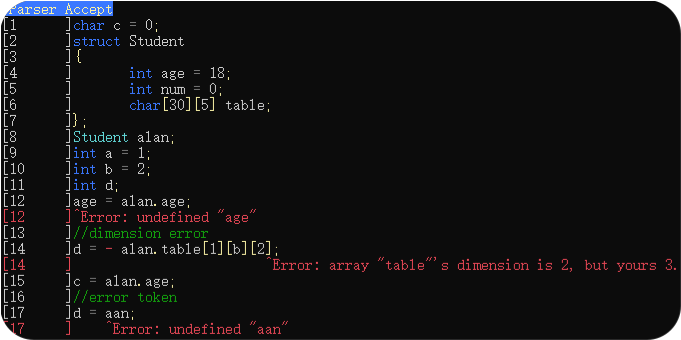

# Mu Compiler Generator

<table border = 0>
    <tr><td align="center"></td>       
        <td>
            <p align="center"><strong>MuCompilerGenerator(MuCplGen)</strong></p>
        	<p align="center">a Header-Only dynamic compiler generator based on C++ 17.</p>
        	<p align="center">Why MuCplGen?</p>
        	<ul align="center"><button>header-only</button> <button>cross-platform</button></ul>
        	<ul align="center"><button>self-contained (without any dependencies)</button></ul>
        	<ul align="center"><button>type-safe semantic action (debug-friendly)</button></ul>
    	</td>
    </tr>
</table>
---




## Requirement

| Platform | Requirement |
| -------- | ----------- |
| Windows  | c++17       |
| Linux    | c++ 17 g++8 |
|          |             |

## Scanner

Regular Expression (Regex) based.

| type            | field                              | detail                             |
| --------------- | ---------------------------------- | ---------------------------------- |
| `std::string`   | [`tokenType`](#Regex with Action)  | readability string token type name |
| `std::regex`    | [`expression`](#Regex with Action) | regex rule                         |
| `int`           | [`priority`](#Recognize Priority)  | to solve conflicts                 |
| `std::function` | [`onSucceed`](#Scanner Action)     | callback when token recognized     |

### Regex with Action

```cpp
auto& num = CreateRule();
//for readability
num.tokenType = "number";
//regex
num.expression = R"(^(\-|\+)?\d+(\.\d+)?)";
//action to do when a token is recoginized
num.onSucceed = [this](std::smatch, Token& token)->ScannActionResult
{
    //custom data, for fast token type dicision
    token.type = Token::TokenType::number;
    //only for debug token highlight as you can see above
    token.color = ConsoleForegroundColor::White;
    //tell the scanner to save this Token
    return SaveToken;
};
```

:heavy_exclamation_mark:	**Remember** to start your regex with `^`, or something weird may happen. e.g. `Hhello` will match the regex `hello`.

- view: [EasyScanner.h](MuCplGen/EasyScanner.h)

### Scanner Action

```cpp
auto& blank = CreateRule();
blank.tokenType = "Blank";
blank.expression = CommonRegex::Blank;
blank.onSucceed = [this](std::smatch, Token&)->ScannActionResult
{
    //to ignore blank as ' ', '\t', '\n' ...
    //if you need the blank token, never Discard it. (e.g. python keeps the blank token)
    return DiscardThisToken;
};

auto& comment = CreateRule();
comment.tokenType = "Comment";
comment.expression = "^//.*";
comment.onSucceed = [this](std::smatch, Token&)->ScannActionResult
{
    //Skip current line
    //usually, comment should be removed by preprocessor
    //it's just example
    return (ScannActionResult)(DiscardThisToken | SkipCurrentLine);
};
```

view: [EasyScanner.h](MuCplGen/EasyScanner.h)

### Default Action

Default action is to "Save the Token" and of course you can set the default action of a scanner

```cpp
struct Scanner
{
public:
    using ScannAction = std::function<ScannActionResult(std::smatch, Token&)>;
    struct ScannRule
    {
        int priority = 0;
        std::string tokenType;
        std::regex expression;
        ScannAction onSucceed;
    };
    ScannRule& CreateRule()
    {
        auto tmp = new ScannRule;
        rules.push_back(tmp);
        return *tmp;
    }
    ScannAction defaultAction;
    ...
}
```

- view: [Scanner.h](MuCplGen/Scanner.h)

### Recognize Priority

Sometimes conflicts occur, e.g. custom-defined identifier may be the same as your predefined keyword, so there's a priority option for you.

A smaller number indicates a higher priority. Default priority is 0.

```cpp
auto& keyword = CreateRule();
keyword.tokenType = "keyword";
keyword.expression = 
    "^(void|char|float|int|return|enum|struct|class|private|switch"
    "|case|break|default|if|else|while|do)";
keyword.onSucceed = [this](std::smatch, Token& token)->ScannActionResult
{
    token.type = Token::TokenType::keyword;
    token.color = ConsoleForegroundColor::Blue;
    return SaveToken;
};

auto& id = CreateRule();
id.priority = 1;
id.tokenType = "identifier";
id.expression = CommonRegex::Identifier;
id.onSucceed = [this](std::smatch, Token& token)->ScannActionResult
{
    token.type = Token::TokenType::identifier;
    token.color = ConsoleForegroundColor::White;
    return SaveToken;
};
```

So "int" will be a keyword rather than an identifier.

view: [EasyScanner.h](MuCplGen/EasyScanner.h)

### Macroscopic Greedy-Match

A Scanner tent to match as long as it can, i.e. if more than 2 regex rule are satisfied, the longer one will be chosen (if they are same in priority).

e.g. 

- `::` will be recognized as `::` rather than `:`and`:`

- `->`will be recognized as `->` rather than `-`and`>`

which is pretty sensible.

if you want to break the rule, use the priority field of a regex rule.

### Debug Your Scanner

cuz, it's your response to define a Token, so, if you want to highlight the Token in console, derive your token from `DebugToken`

```cpp
namespace MuCplGen::Debug
{
	struct DebugToken :public BaseToken
	{
		ConsoleForegroundColor color = ConsoleForegroundColor::White;
	};
}
```

```cpp
struct MyToken : public DebugToken
{
    ...
}
```

Thus, `MuCplGen::Debug::Highlight()` will highlight your content.

```cpp
auto input_text = FileLoader::Load("easy.txt");
EasyScanner easyScanner;
auto token_set = easyScanner.Scann(input_text);
Debug::Highlight(input_text, token_set);
```

Of curse, `Highlight()` can show error info more readably.

```cpp
template<typename Token = DebugToken>
void Highlight(
    std::vector<LineContent>& input_text, std::vector<Token>& token_set,
    std::vector<std::pair<size_t, std::string>>& error_info_pair, std::ostream& log = std::cout)
```

The first field of `std::pair<size_t, std::string>` is a token iterator,  indicates the error token index in token_set, and the second is, self-explanatory, the error info.

## Syntax-Directed Parser

Context Free Grammar (CFG) based.

| Parser     | Usage                    |                    |
| ---------- | ------------------------ | ------------------ |
| SLR        | `SLRParser<UserToken,T>` | :heavy_check_mark: |
| LR1        | `LR1Parser<UserToken,T>` | :heavy_check_mark: |
| BaseParser |                          | :x:                |

